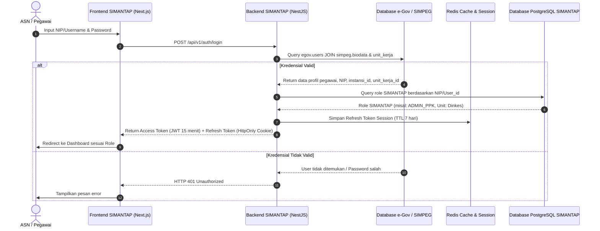

# PRODUCT REQUIREMENT DOCUMENT (PRD)

---

## 1. DOKUMEN KONTROL & METADATA PROYEK

| Parameter | Deskripsi |
| :--- | :--- |
| **Nama Proyek** | **SIMANTAP** (Sistem Informasi Monitoring dan Evaluasi Data Pembangunan Terpadu) |
| **Instansi Pengampu** | Bagian Administrasi Pembangunan, Sekretariat Daerah Kabupaten Konawe Selatan |
| **Tahun Anggaran** | 2026 |
| **Versi Dokumen** | v1.0.0 (Comprehensive Baseline) |
| **Status Dokumen** | Draft Final / Approved for Development |
| **Target Penyelesaian** | 30 Hari Kalender (Fase MVP / KAK) |
| **Dasar Kebijakan** | - UU No. 23/2014 tentang Pemerintahan Daerah<br>- Perpres No. 16/2018 jo. Perpres No. 12/2021 (PBJ Pemerintah)<br>- Perpres No. 95/2018 (SPBE) & Perpres No. 132/2022 (Arsitektur SPBE Nasional)<br>- Dokumen KAK Bagian Administrasi Pembangunan Kab. Konawe Selatan |

---

## 2. RINGKASAN EKSEKUTIF & LATAR BELAKANG

### 2.1 Latar Belakang
Pemerintah Kabupaten Konawe Selatan melalui Bagian Administrasi Pembangunan Sekretariat Daerah memiliki tanggung jawab strategis dalam koordinasi, pemantauan, evaluasi, dan pengendalian terhadap realisasi pelaksanaan program/kegiatan pembangunan yang didanai oleh Anggaran Pendapatan dan Belanja Daerah (APBD) maupun sumber dana lainnya (APBN, DAK, DAU).

Selama ini, proses monitoring dan evaluasi menghadapi berbagai kendala:
1. **Pencatatan Parsial & Tersebar**: Data perencanaan paket pengadaan (SiRUP), kontrak riil, target fisik, dan serapan keuangan masih dikelola secara terpisah (manual spreadsheet / hardcopy).
2. **Keterlambatan Deteksi Kontrak Kritis**: Belum adanya sistem terpadu yang menghitung deviasi keterlambatan proyek secara otomatis (real time) mengakibatkan lambatnya tindak lanjut penanganan proyek yang terlambat (Show Cause Meeting / SCM).
3. **Disparitas Data Fisik vs Keuangan**: Sering terjadi ketidaksesuaian antara persentase fisik di lapangan dengan serapan pencairan anggaran SP2D.
4. **Birokrasi Pelaporan RFK yang Lambat**: Rekonsiliasi Realisasi Fisik dan Keuangan (RFK) antar OPD memakan waktu lama saat pimpinan daerah (Bupati, Wakil Bupati, Sekda) memerlukan laporan eksekutif cepat.

### 2.2 Maksud dan Tujuan
- **Digitalisasi Sentral**: Menyediakan sistem informasi terpusat berbasis web untuk seluruh OPD di lingkungan Pemkab Konawe Selatan.
- **Standarisasi Alur Kerja**: Memisahkan peran penatausahaan data paket secara akuntabel (Input Data SiRUP -> Target Capaian -> Realisasi Fisik -> Realisasi Keuangan -> Telaah OPD -> Evaluasi Pimpinan).
- **Early Warning System (EWS)**: Menghitung deviasi capaian kinerja secara otomatis guna mendeteksi potensi deviasi negatif (kontrak kritis) secara dini.
- **Single Source of Truth**: Integrasi data identitas ASN dan penugasan dari **SIMPEG** dan **e-Gov Konawe Selatan**.
- **Otomasi Laporan RFK**: Menghasilkan dokumen rekapitulasi RFK siap cetak (PDF resmi) dan ekspor lembar kerja (Excel) sesuai format baku Pemerintah Daerah.

---

## 3. ARSITEKTUR & TEKNOLOGI STACK

SIMANTAP dibangun dengan pendekatan arsitektur modern **Decoupled Architecture** (Pemisahan menyeluruh antara Frontend Client-Side Application dan Backend API Micro/Monolithic Engine) yang menjamin performa tinggi, keamanan berstandar enterprise, serta skalabilitas masa depan.

```
+-----------------------------------------------------------------------------------+
|                            CLIENT / FRONTEND LAYER                                |
|  Next.js (App Router, TS) | TanStack Query | Tailwind CSS | Debounced Search       |
|  Wrapper Silent Refresh Token | Role-Based UI Guard | Responsive Web Engine       |
+------------------------------------------+----------------------------------------+
                                           |
                                [ HTTPS / REST API ]
                                [ JWT Bearer + Cookie ]
                                           |
+------------------------------------------v----------------------------------------+
|                            SERVER / BACKEND LAYER                                 |
|  NestJS Framework (Modular, Guards, Pipes, Interceptors, Filters)                |
|  Prisma ORM (PostgreSQL Client) | Redis (Cache, Session, Rate Limit)               |
|  BullMQ Worker (Queue: Async Report Generator & Email Notification Engine)        |
+-------------------+---------------------------------------+-----------------------+
                    |                                       |
+-------------------v---------------+       +---------------v-----------------------+
|        DATABASE LAYER             |       |       EXTERNAL INTEGRATION            |
|  - PostgreSQL (SIMANTAP Core)     |       |  - e-Gov Konawe Selatan (Auth)        |
|  - Prisma Migrations & Relations  |       |  - SIMPEG Konawe Selatan (NIP/Pegawai)|
|  - Redis Server (In-Memory Data)  |       |  - SMTP / Email Mailer Gateway        |
+-----------------------------------+       +---------------------------------------+
```

### 3.1 Frontend Stack
- **Framework Core**: **Next.js** (App Router, React Server Components + Client Boundary, TypeScript).
- **Data Fetching & State**: **TanStack Query (React Query v5)** untuk caching cerdas, automatic revalidation, optimistic updates, dan stale time management.
- **Styling & UI System**: **Tailwind CSS** dipadukan dengan headless UI components (Lucide React Icons, Radix UI primitives) yang responsif untuk desktop, laptop, dan tablet.
- **Optimasi Interaksi**: **Debounced Input Wrapper** (`useDebounce`) untuk fitur live filter, pencarian data paket ribuan baris tanpa bottleneck network.
- **Autentikasi & Request Client**: Custom HTTP Client (Axios wrapper) dengan **Axios Interceptor** untuk penanganan silent refresh token otomatis (tanpa logout paksa saat token kedaluwarsa).

### 3.2 Backend Stack
- **Framework Core**: **NestJS** (Node.js framework berbasis TypeScript dengan arsitektur modular: Controller, Service, Module, DTO, Guard, Interceptor).
- **Database Engine**: **PostgreSQL** (Relational Database Management System untuk konsistensi transaksi finansial ACID).
- **ORM & Data Mapping**: **Prisma ORM** untuk schema definition, automated migration, dan type-safe database queries.
- **Caching & In-Memory Store**: **Redis** untuk session management, rate limiting, caching query dashboard eksekutif, dan token invalidation / blacklist.
- **Background Job Queue**: **BullMQ** (Redis-based queue) untuk mengisolasi proses berat:
  1. *Email Sender Service* (pengiriman notifikasi kontrak kritis, pengingat deadline bulanan).
  2. *Export Engine* (pembentukan dokumen PDF ber-barcode dan spreadsheet Excel ribuan paket tanpa membebani thread HTTP utama).
- **Notification & Mailer**: **Nodemailer / NestJS Mailer** terintegrasi via BullMQ worker.

---

## 4. ROLE-BASED ACCESS CONTROL (RBAC) & MATRIX WEWENANG

Manajemen pengguna SIMANTAP dirancang berjenjang per Organisasi Perangkat Daerah (OPD) dan Unit Kerja, terintegrasi dengan data pegawai dari **SIMPEG** dan akun **e-Gov Konawe Selatan**:

| No | Nama Role | Kategori Level | Deskripsi & Hak Akses Utama |
| :--- | :--- | :--- | :--- |
| **1** | **Administrator** | Tingkat Kabupaten (Bagian Pembangunan / Bappeda) | **Full Access**: Mengelola master data, mapping akun e-Gov/SIMPEG ke unit kerja, konfigurasi threshold deviasi kontrak kritis, lock/unlock periode pelaporan bulanan, verifikasi akhir RFK kabupaten, serta audit trail. |
| **2** | **ADMIN SIRUP** | Operator OPD / Sub-Unit Kerja | **Input Data Awal Paket**: Menginput dan mengimpor data paket pengadaan (16 parameter paket), sinkronisasi RUP, penetapan pagu, nilai kontrak, nomor kontrak, rekanan, dan tanggal pelaksanaan. |
| **3** | **ADMIN PERENCANAAN** | Perencana OPD | **Penetapan Baseline Target**: Menentukan target rencana fisik kumulatif/bulanan (% per bulan B01 - B12) dan rencana penyerapan anggaran kas (Rp) sesuai dokumen DPA-OPD. |
| **4** | **ADMIN PPK** | Pejabat Pembuat Komitmen OPD | **Penetapan Realisasi Fisik**: Menginput capaian realisasi fisik riil bulanan (%), mengunggah evidensi/milestone/foto dokumentasi lapangan, dan memberikan catatan teknis kendala pekerjaan. |
| **5** | **BENDAHARA (Admin Realisasi)** | Bendahara Pengeluaran OPD | **Penetapan Realisasi Keuangan**: Menginput dan memverifikasi data penyerapan anggaran riil (Rp SP2D/SPM) per bulan untuk tiap paket, memastikan kesesuaian kas keluar dengan laporan keuangan daerah. |
| **6** | **KEPALA OPD** | Pimpinan OPD | **Telaah & Approval Internal**: Melakukan telaah terhadap keselarasan fisik vs keuangan seluruh kegiatan di dinasnya, memberikan catatan disposisi/arahan, dan melakukan *Approval Lock* laporan bulanan sebelum dikirim ke Bagian Pembangunan. |
| **7** | **BUPATI / WABUP / SEKDA** | Pimpinan Daerah (Eksekutif) | **Monitoring Eksekutif (Read-Only High Level)**: Melihat dashboard rekapitulasi se-Kabupaten Konawe Selatan, kurva deviasi, pemetaan OPD berperforma rendah, daftar proyek kontrak kritis, dan rekap penyerapan APBD secara real time. |

### 4.1 Matriks Aksi CRUD Berdasarkan Role

| Fitur / Modul | Admin Kab. | Admin SiRUP | Admin Ren. | Admin PPK | Bendahara | Ka. OPD | Pimpinan (Bupati/Sekda) |
| :--- | :---: | :---: | :---: | :---: | :---: | :---: | :---: |
| **Master Instansi & User Mapping** | CRUD | - | - | - | - | - | R (Read) |
| **Input 16 Parameter Paket** | CRUD | CRUD* | R* | R* | R* | R* | R |
| **Target Fisik & Keuangan (B01-B12)** | CRUD | R* | CRUD* | R* | R* | R* | R |
| **Input Realisasi Fisik & Foto Lapangan** | CRUD | R* | R* | CRUD* | R* | R* | R |
| **Input Realisasi Keuangan (SP2D)** | CRUD | R* | R* | R* | CRUD* | R* | R |
| **Telaah Hasil & Approval Bulanan OPD** | R | R* | R* | R* | R* | Approve* | R |
| **Buka Kunci Pelaporan (Unlock Period)** | Update | - | - | - | - | - | - |
| **Ekspor RFK Excel & PDF** | Yes | Yes* | Yes* | Yes* | Yes* | Yes* | Yes (Kabupaten) |
| **Dashboard Eksekutif & Early Warning** | Yes | - | - | - | - | Yes* | Yes (Full Kab.) |

*\*Catatan: Akses data operator OPD dibatasi hanya pada instansi/unit kerja tempat akun tersebut terdaftar (Row-Level Security / OPD Tenant Isolation).*

---

## 5. SKEMA INTEGRASI AKUN (SIMPEG & E-GOV KONAWE SELATAN)

### 5.1 Arsitektur Single Identity
Sistem SIMANTAP tidak membuat basis data otentikasi pegawai baru yang terisolasi, melainkan terhubung langsung dengan ekosistem kepegawaian Pemerintah Kabupaten Konawe Selatan:
1. **Identitas Pengguna**: Mengacu pada NIP (Nomor Induk Pegawai) ASN yang terdaftar di basis data **SIMPEG**.
2. **Kredensial & Autentikasi**: Menggunakan akun **e-Gov** Konawe Selatan (`egov.users`).
3. **Struktur Organisasi**: Menautkan unit kerja dan dinas secara otomatis melalui tabel referensi `simpeg.unit_kerja` dan `simpeg.instansi`.
4. **Otorisasi SIMANTAP**: Akun e-Gov di-mapping ke tabel `simantap_user_roles` untuk menentukan perannya (Admin SiRUP, Admin PPK, Bendahara, Kepala OPD, dll).



---

## 6. SPESIFIKASI MODUL & KEBUTUHAN FUNGSIONAL (BERDASARKAN KAK)

### 6.1 MODUL 1: DATA PAKET & TARGET PEMBANGUNAN (ADMINISTRASI KONTRAK & BASELINE)
Modul ini menjadi gerbang utama penatausahaan proyek fisik maupun non-fisik pengadaan barang/jasa.

#### 16 Parameter Paket Pekerjaan (Wajib KAK):
1. **Instansi / OPD**: Relasi otomatis ke ID Instansi (SIMPEG/e-Gov).
2. **Sub-Unit Kerja**: Bidang / Seksi pelaksana teknis kegiatan.
3. **Kode RUP / Kontrak**: Nomor unik rencana umum pengadaan SiRUP LKPP atau kode internal.
4. **Nama Paket Pekerjaan**: Uraian spesifik pekerjaan konstruksi atau pengadaan.
5. **Tahun Anggaran**: Tahun APBD berjalan (misal: 2026).
6. **Lokasi Kegiatan**: Kecamatan, Kelurahan/Desa, atau titik koordinat proyek.
7. **Metode Pemilihan Penyedia**: Enum (`Tender`, `Pengadaan Langsung`, `Penunjukan Langsung`, `E-Purchasing / E-Katalog`, `Swakelola`).
8. **Jenis Pengadaan**: Enum (`Pekerjaan Konstruksi`, `Pengadaan Barang`, `Jasa Konsultansi`, `Jasa Lainnya`).
9. **Nilai Pagu Anggaran (Rp)**: Besaran pagu berdasarkan Dokumen Pelaksanaan Anggaran (DPA).
10. **Nilai Kontrak (Rp)**: Besaran nilai kontrak yang disepakati dengan pemenang tender.
11. **Sumber Pendanaan**: Enum (`APBD Kabupaten`, `APBN`, `DAK Fisik`, `DAK Non-Fisik`, `DAU`, `DBH`).
12. **Nomor Kontrak / SPK**: Nomor legalitas kontrak kerja sama.
13. **Tanggal Mulai Kontrak**: Tanggal dimulainya SPMK (Surat Perintah Mulai Kerja).
14. **Tanggal Selesai Kontrak**: Batas akhir masa pelaksanaan sesuai kontrak.
15. **Pemenang Tender / Nama Rekanan**: Badan usaha/kontraktor pelaksana (beserta NPWP Perusahaan).
16. **Keterangan / Catatan Khusus**: Status addendum waktu/biaya, masa pemeliharaan, atau catatan teknis.

#### Sub-Fitur Target Bulanan (Baseline):
- **Input Rencana Fisik**: Distribusi target fisik bulanan (Januari s/d Desember / B01 - B12) dalam satuan persen (%). Validasi sistem memastikan total akumulasi B12 tepat 100%.
- **Input Rencana Keuangan**: Distribusi rencana penyerapan kas (Rp) per bulan B01 - B12.

---

### 6.2 MODUL 2: REALISASI FISIK & KEUANGAN BULANAN (PERIODIK B01 - B12)
Mendukung input pelaporan berkala setiap bulan berjalan yang terhubung langsung dengan paket kegiatan.

- **Input Capaian Fisik Bulanan (%)**: Diinput oleh **ADMIN PPK**. Mencakup capaian progres riil lapangan pada periode bersangkutan.
- **Input Realisasi Keuangan Bulanan (Rp)**: Diinput oleh **BENDAHARA**. Berdasarkan SPM/SP2D yang telah dicairkan oleh BPKAD.
- **Evidensi & Dokumentasi Lapangan**: Unggah file foto perkembangan fisik (0%, 50%, 100%), laporan konsultan pengawas, dan softcopy BAP (Berita Acara Pembayaran).
- **Kalkulasi Akumulatif Otomatis**:
  $$\text{Fisik Akumulatif Bulan } n = \sum_{i=1}^{n} \text{Fisik Bulan } i$$
  $$\text{Keuangan Akumulatif Bulan } n = \sum_{i=1}^{n} \text{Keuangan Bulan } i$$
  $$\text{Persentase Keuangan } (\%) = \left(\frac{\text{Keuangan Akumulatif}}{\text{Nilai Kontrak}}\right) \times 100\%$$

---

### 6.3 MODUL 3: LAPORAN & EVALUASI PEMBANGUNAN (RFK & EARLY WARNING SYSTEM)
Menyajikan penyandingan antara target rencana vs realisasi riil secara dinamis dan otomatis.

#### Logika Perhitungan Deviasi:
$$\text{Deviasi Fisik (\%)} = \text{Realisasi Fisik Akumulatif (\%)} - \text{Target Fisik Akumulatif (\%)}$$

#### Penentuan Status Kontrak & Proyek:
1. **Status Aman (On Track - Hijau)**: Deviasi $\ge 0\%$ (Progres lapangan sesuai atau melampaui jadwal rencana).
2. **Status Waspada (Kuning)**: Deviasi antara $-0.01\%$ hingga $-10.00\%$ (Terjadi keterlambatan minor, memerlukan evaluasi internal PPK).
3. **Status Kontrak Kritis (Merah)**:
   - Deviasi $< -10.00\%$ (Keterlambatan berat).
   - Realisasi keuangan $\ll$ Target keuangan $> 2$ bulan berturut-turut.
   - Otomatis memicu notifikasi peringatan (*Early Warning Notification*) via email dan dashboard ke Kepala OPD, PPK, dan Sekda.

#### Fitur Ekspor Laporan:
- **Laporan RFK Kabupaten & OPD**: Ekspor ke Microsoft Excel (`.xlsx`) dengan format sel terformat rapi sesuai baku Perpres/Kemendagri.
- **Cetak Lembar Evaluasi PDF**: Format cetak landscape dilengkapi stempel digital / QR-Code validasi keabsahan dokumen tanda tangan Kepala Bagian Administrasi Pembangunan / Sekda.

---

### 6.4 MODUL 4: TELAAH KEPALA OPD & PENGUNCIAN PERIODE (LOCKING SYSTEM)
- **Review Disposisi**: Kepala OPD memeriksa rekap laporan dinasnya sebelum dikirimkan. Terdapat tombol *Setujui & Kirim* atau *Kembalikan dengan Catatan Revisi*.
- **Locking Periode Bulanan**: Sistem menerapkan pembatasan waktu input (misal tanggal 5 setiap bulannya). Setelah tanggal cut-off, form input terkunci otomatis (*Read-Only*). Pembukaan kunci (*Unlock*) hanya dapat diotorisasi oleh **Administrator Kabupaten** disertai alasan resmi.

---

### 6.5 MODUL 5: DASHBOARD EKSEKUTIF (BUPATI / WABUP / SEKDA)
- **Ringkasan Makro**:
  - Total Paket Pembangunan Daerah & Total Pagu vs Total Kontrak.
  - Rata-rata Progres Fisik Daerah vs Rata-rata Serapan Keuangan Daerah.
  - Efisiensi / Sisa Lebih Pemilihan Penyedia (Selisih Pagu vs Kontrak).
- **Visualisasi Kurva S Interaktif**: Membandingkan garis kurva Target Rencana vs Realisasi Riil bulanan (se-Kabupaten atau filter per OPD).
- **Radar Deviasi OPD**: Grafik perbandingan OPD dengan deviasi positif tertinggi (kinerja terbaik) dan OPD dengan deviasi negatif terbesar (proyek lambat).
- **Tabel Peringatan Dini Kontrak Kritis**: Daftar paket dengan status merah yang memerlukan atensi Bupati/Sekda secara langsung.

---

## 7. DETAIL TEKNIS FRONTEND (NEXT.JS)

### 7.1 Struktur Folder Proyek (Next.js App Router)
```
src/
├── app/
│   ├── (auth)/
│   │   └── login/
│   │       └── page.tsx
│   ├── (dashboard)/
│   │   ├── layout.tsx
│   │   ├── dashboard/page.tsx               # Dashboard Eksekutif & Ringkasan
│   │   ├── paket/
│   │   │   ├── page.tsx                     # List 16 Parameter Paket (Admin SiRUP)
│   │   │   ├── [id]/page.tsx                # Detail Paket & History
│   │   │   └── tambah/page.tsx              # Form Tambah Paket
│   │   ├── target/
│   │   │   └── page.tsx                     # Penetapan Baseline B01-B12 (Admin Ren)
│   │   ├── realisasi-fisik/
│   │   │   └── page.tsx                     # Input Capaian Fisik & Evidensi (PPK)
│   │   ├── realisasi-keuangan/
│   │   │   └── page.tsx                     # Input SP2D Realisasi (Bendahara)
│   │   ├── telaah-opd/
│   │   │   └── page.tsx                     # Telaah & Approval Laporan (Kepala OPD)
│   │   ├── laporan-rfk/
│   │   │   └── page.tsx                     # Rekapitulasi & Export Excel/PDF
│   │   └── pengaturan/
│   │       ├── pengguna/page.tsx            # Mapping User e-Gov & Role
│   │       └── periode/page.tsx             # Lock / Unlock Periode Input
│   ├── api/                                 # Next.js Route Handlers (BFF if needed)
│   ├── layout.tsx
│   └── globals.css
├── components/
│   ├── common/                              # Button, Modal, Badge, Tooltip, Input
│   ├── charts/                              # Kurva S, Bar Chart Serapan, Donut Chart
│   ├── tables/                              # DataTable dengan Pagination & Sort
│   ├── forms/                               # Form Paket 16 Parameter, Form Realisasi
│   └── layout/                              # Sidebar, Topbar Navbar, Breadcrumbs
├── hooks/
│   ├── useDebounce.ts                       # Custom hook debounced input
│   ├── useAuth.ts                           # Hook state user & RBAC
│   └── usePermissions.ts                    # Hook verifikasi hak akses modul
├── lib/
│   ├── axios.ts                             # Axios client + Silent Refresh Token Interceptor
│   ├── react-query.ts                       # QueryClient configuration
│   └── utils.ts                             # Format Rupiah, Tanggal, Deviasi Color
├── services/                                # TanStack Query hooks (usePaket, useRealisasi)
└── types/                                   # TypeScript interfaces & DTO definitions
```

### 7.2 Implementasi TanStack Query & Debounced Filtering
- **Query Keys Convention**:
  - `['paket', { opdId, tahun, search, page }]`
  - `['realisasi', { paketId, bulan }]`
  - `['dashboard-stats', { tahun }]`
- **Debounced Live Filter**: Input pencarian nama paket, kode RUP, rekanan dikontrol dengan `useDebounce(searchTerm, 400)`. Request ke server hanya dilakukan 400ms setelah user berhenti mengetik, menghemat beban server secara drastis.
- **Optimistic Updates**: Saat PPK memperbarui persentase fisik, nilai pada tabel diperbarui seketika di sisi client sembari menunggu konfirmasi mutasi dari API backend.

### 7.3 Custom HTTP Client & Silent Refresh Token Rotation
```typescript
// src/lib/axios.ts
import axios from 'axios';

export const apiClient = axios.create({
  baseURL: process.env.NEXT_PUBLIC_API_URL || 'http://localhost:4000/api/v1',
  withCredentials: true, // Mengirim httpOnly refresh token cookie
});

// Request Interceptor: Attach Access Token
apiClient.interceptors.request.use((config) => {
  const token = localStorage.getItem('access_token');
  if (token && config.headers) {
    config.headers.Authorization = `Bearer ${token}`;
  }
  return config;
});

// Response Interceptor: Handle 401 & Silent Refresh Token
let isRefreshing = false;
let failedQueue: Array<{ resolve: (token: string) => void; reject: (err: any) => void }> = [];

apiClient.interceptors.response.use(
  (response) => response,
  async (error) => {
    const originalRequest = error.config;
    if (error.response?.status === 401 && !originalRequest._retry) {
      if (isRefreshing) {
        return new Promise((resolve, reject) => {
          failedQueue.push({ resolve, reject });
        }).then((token) => {
          originalRequest.headers.Authorization = `Bearer ${token}`;
          return apiClient(originalRequest);
        });
      }

      originalRequest._retry = true;
      isRefreshing = true;

      try {
        const { data } = await axios.post(
          `${process.env.NEXT_PUBLIC_API_URL}/auth/refresh`,
          {},
          { withCredentials: true }
        );
        const newToken = data.access_token;
        localStorage.setItem('access_token', newToken);
        apiClient.defaults.headers.common.Authorization = `Bearer ${newToken}`;
        failedQueue.forEach((prom) => prom.resolve(newToken));
        failedQueue = [];
        return apiClient(originalRequest);
      } catch (refreshError) {
        failedQueue.forEach((prom) => prom.reject(refreshError));
        failedQueue = [];
        localStorage.removeItem('access_token');
        window.location.href = '/login?session_expired=true';
        return Promise.reject(refreshError);
      } finally {
        isRefreshing = false;
      }
    }
    return Promise.reject(error);
  }
);
```

---

## 8. DETAIL TEKNIS BACKEND (NESTJS)

### 8.1 Arsitektur Modular NestJS
```
src/
├── app.module.ts
├── main.ts
├── common/
│   ├── decorators/                          # @CurrentUser(), @Roles(), @Public()
│   ├── filters/                             # HttpExceptionFilter, PrismaExceptionFilter
│   ├── guards/                              # JwtAuthGuard, RolesGuard, OpdScopeGuard
│   ├── interceptors/                        # TransformResponseInterceptor, LoggingInterceptor
│   └── pipes/                               # Custom Validation Pipe (Zod / Class-Validator)
├── config/                                  # Environment variables configuration
├── database/
│   ├── prisma.module.ts
│   └── prisma.service.ts                    # Extended Prisma Client
├── modules/
│   ├── auth/                                # Login e-Gov, Token Rotation, Session Redis
│   ├── users/                               # User management & SIMPEG sync
│   ├── opd/                                 # Master OPD & Sub-unit kerja
│   ├── paket/                               # CRUD 16 Parameter Paket
│   ├── target/                              # Baseline Target Bulanan (B01-B12)
│   ├── realisasi-fisik/                     # Progres Fisik, Evidensi & Milestone
│   ├── realisasi-keuangan/                  # SP2D & Realisasi Kas Bulanan
│   ├── evaluasi-rfk/                        # Kalkulasi Deviasi, Kurva S, Rekapitulasi
│   ├── approval-telaah/                     # Workflow Telaah Kepala OPD
│   ├── notifications/                       # BullMQ Email Sender & System Alert
│   └── export/                              # Exceljs & Puppeteer PDF Generator Worker
```

### 8.2 Database Schema (Prisma Schema untuk PostgreSQL)

```prisma
datasource db {
  provider = "postgresql"
  url      = env("DATABASE_URL")
}

generator client {
  provider = "prisma-client-js"
}

enum RoleEnum {
  ADMINISTRATOR
  ADMIN_SIRUP
  ADMIN_PERENCANAAN
  ADMIN_PPK
  BENDAHARA
  KEPALA_OPD
  PIMPINAN_DAERAH // Bupati, Wabup, Sekda
}

enum MetodePemilihan {
  TENDER
  PENGADAAN_LANGSUNG
  PENUNJUKAN_LANGSUNG
  E_PURCHASING
  SWAKELOLA
}

enum JenisPengadaan {
  KONSTRUKSI
  PENGADAAN_BARANG
  JASA_KONSULTANSI
  JASA_LAINNYA
}

enum SumberDana {
  APBD
  APBN
  DAK_FISIK
  DAK_NON_FISIK
  DAU
  DBH
}

enum StatusProyek {
  AMAN
  WASPADA
  KONTRAK_KRITIS
}

enum StatusApproval {
  DRAFT
  DIAJUKAN
  DISETUJUI
  DITOLAK
}

model Opd {
  id              String         @id @default(uuid())
  kodeOpd         String         @unique
  namaOpd         String
  alamat          String?
  subUnits        SubUnit[]
  users           User[]
  paketPekerjaan  PaketPekerjaan[]
  laporanBulanan  LaporanBulananOpd[]
  createdAt       DateTime       @default(now())
  updatedAt       DateTime       @updatedAt
}

model SubUnit {
  id              String         @id @default(uuid())
  opdId           String
  namaSubUnit     String
  opd             Opd            @relation(fields: [opdId], references: [id], onDelete: Cascade)
  paketPekerjaan  PaketPekerjaan[]
  createdAt       DateTime       @default(now())
  updatedAt       DateTime       @updatedAt
}

model User {
  id              String         @id @default(uuid())
  nip             String         @unique
  namaLengkap     String
  jabatan         String?
  email           String?
  role            RoleEnum
  opdId           String?
  opd             Opd?           @relation(fields: [opdId], references: [id])
  isActive        Boolean        @default(true)
  createdAt       DateTime       @default(now())
  updatedAt       DateTime       @updatedAt

  createdPaket    PaketPekerjaan[] @relation("CreatedBy")
  evidensiFisik   EvidensiFisik[]
  auditLogs       AuditLog[]
}

model PaketPekerjaan {
  id                String           @id @default(uuid())
  opdId             String
  subUnitId         String?
  kodeRup           String           @unique
  namaPaket         String
  tahunAnggaran     Int              @default(2026)
  lokasiKegiatan    String
  metodePemilihan   MetodePemilihan
  jenisPengadaan    JenisPengadaan
  nilaiPagu         Decimal          @db.Decimal(15, 2)
  nilaiKontrak      Decimal          @db.Decimal(15, 2)
  sumberDana        SumberDana
  nomorKontrak      String?
  tanggalMulai      DateTime?
  tanggalSelesai    DateTime?
  rekananPemenang   String?
  npwpRekanan       String?
  keterangan        String?          @db.Text
  statusTerkini     StatusProyek     @default(AMAN)

  createdById       String
  createdBy         User             @relation("CreatedBy", fields: [createdById], references: [id])
  opd               Opd              @relation(fields: [opdId], references: [id])
  subUnit           SubUnit?         @relation(fields: [subUnitId], references: [id])

  targetBulanan     TargetBulanan[]
  realisasiBulanan  RealisasiBulanan[]
  evidensi          EvidensiFisik[]

  createdAt         DateTime         @default(now())
  updatedAt         DateTime         @updatedAt
}

model TargetBulanan {
  id                String         @id @default(uuid())
  paketId           String
  bulan             Int            // 1 s/d 12
  targetFisik       Decimal        @db.Decimal(5, 2)  // % target bulanan
  targetKeuangan    Decimal        @db.Decimal(15, 2) // Rp target kas bulanan
  paket             PaketPekerjaan @relation(fields: [paketId], references: [id], onDelete: Cascade)

  @@unique([paketId, bulan])
}

model RealisasiBulanan {
  id                  String         @id @default(uuid())
  paketId             String
  bulan               Int            // 1 s/d 12
  realisasiFisik      Decimal        @db.Decimal(5, 2)  // % realisasi bulan berjalan
  realisasiKeuangan   Decimal        @db.Decimal(15, 2) // Rp pencairan SP2D bulan berjalan
  nomorSp2d           String?
  catatanKendala      String?        @db.Text
  deviasiFisik        Decimal?       @db.Decimal(6, 2)  // deviasi s/d bulan n
  statusKritis        StatusProyek   @default(AMAN)
  isLocked            Boolean        @default(false)
  paket               PaketPekerjaan @relation(fields: [paketId], references: [id], onDelete: Cascade)

  @@unique([paketId, bulan])
}

model EvidensiFisik {
  id          String         @id @default(uuid())
  paketId     String
  bulan       Int
  fileUrl     String
  fileName    String
  keterangan  String?
  uploadedById String
  uploadedBy  User           @relation(fields: [uploadedById], references: [id])
  paket       PaketPekerjaan @relation(fields: [paketId], references: [id], onDelete: Cascade)
  createdAt   DateTime       @default(now())
}

model LaporanBulananOpd {
  id            String         @id @default(uuid())
  opdId         String
  tahun         Int
  bulan         Int
  status        StatusApproval @default(DRAFT)
  catatanKepala String?        @db.Text
  disetujuiPada DateTime?
  disetujuiOleh String?
  opd           Opd            @relation(fields: [opdId], references: [id])

  @@unique([opdId, tahun, bulan])
}

model PeriodePenguncian {
  id            String         @id @default(uuid())
  tahun         Int
  bulan         Int
  isLocked      Boolean        @default(false)
  batasInput    DateTime
  diubahOleh    String?
  createdAt     DateTime       @default(now())
  updatedAt     DateTime       @updatedAt

  @@unique([tahun, bulan])
}

model AuditLog {
  id          String         @id @default(uuid())
  userId      String?
  action      String
  entity      String
  entityId    String?
  payload     Json?
  ipAddress   String?
  userAgent   String?
  createdAt   DateTime       @default(now())
  user        User?          @relation(fields: [userId], references: [id])
}
```

### 8.3 Background Worker & Redis Queue (BullMQ)
1. **Email Notification Queue (`notification-queue`)**:
   - Menghandle pengiriman notifikasi otomatis saat sebuah paket terindikasi **KONTRAK KRITIS** (Deviasi fisik $< -10\%$).
   - Mengirim reminder email H-3 penutupan batas input laporan bulanan (*cut-off period*) kepada operator OPD & PPK.
2. **Export Report Queue (`export-queue`)**:
   - Pembentukan file rekapitulasi Excel berukuran besar (> 5.000 baris kegiatan) diproses di latar belakang menggunakan worker thread terpisah.
   - Hasil generate disimpan di storage server / MinIO / S3 dan tautan unduhan dikirimkan via Web-Push / In-App Notification.

---

## 9. BLUEPRINT API ENDPOINTS (RESTFUL SPECIFICATION)

Semua endpoint dilindungi oleh `JwtAuthGuard` dan `RolesGuard` kecuali rute autentikasi. Format respon terstandardisasi: `{ success: boolean, statusCode: number, message: string, data: any, meta?: any }`.

### 9.1 Autentikasi & Profil Pegawai
- `POST /api/v1/auth/login`: Autentikasi NIP & password terhadap basis data e-Gov / SIMPEG Konawe Selatan. Mengembalikan JWT Access Token dan HTTP-Only Refresh Cookie.
- `POST /api/v1/auth/refresh`: Refresh token rotation via Redis session validator.
- `POST /api/v1/auth/logout`: Menghapus session aktif di Redis dan meng-invalidasi refresh token.
- `GET /api/v1/auth/profile`: Mengambil biodata pegawai aktif, jabatan, hak akses role, dan instansi asal.

### 9.2 Modul Data Paket (Admin SiRUP & Administrator)
- `GET /api/v1/paket`: Mengambil daftar paket pekerjaan dengan query parameter (page, limit, search, opdId, jenisPengadaan, sumberDana, status).
- `GET /api/v1/paket/:id`: Mengambil detail lengkap 16 parameter paket beserta riwayat target dan realisasinya.
- `POST /api/v1/paket`: Membuat data paket baru (16 parameter sesuai KAK).
- `PUT /api/v1/paket/:id`: Memperbarui data paket (hanya dapat diedit jika periode belum ditutup).
- `DELETE /api/v1/paket/:id`: Menghapus paket pekerjaan (hanya jika belum memiliki catatan realisasi keuangan).

### 9.3 Modul Baseline Target Bulanan (Admin Perencanaan)
- `GET /api/v1/paket/:id/target`: Mendapatkan sebaran target fisik (%) dan keuangan (Rp) periode B01 - B12.
- `PUT /api/v1/paket/:id/target`: Menyimpan atau mengoreksi baseline target 12 bulan (dengan validasi total fisik akumulasi B12 = 100%).

### 9.4 Modul Realisasi Fisik & Evidensi (Admin PPK)
- `POST /api/v1/realisasi/fisik`: Menginput capaian fisik bulanan (%) beserta catatan kendala lapangan.
- `POST /api/v1/realisasi/evidensi/upload`: Mengunggah file gambar dokumentasi lapangan (JPG/PNG/PDF maks 5MB per file).
- `GET /api/v1/realisasi/fisik/:paketId`: Mengambil rekam jejak progres fisik per bulan.

### 9.5 Modul Realisasi Keuangan (Bendahara / Admin Realisasi)
- `POST /api/v1/realisasi/keuangan`: Menginput penyerapan anggaran riil (Rp) dan nomor bukti SP2D.
- `GET /api/v1/realisasi/keuangan/:paketId`: Mengambil data penyerapan kas riil per bulan.

### 9.6 Modul Laporan, Telaah & Evaluasi RFK
- `GET /api/v1/evaluasi/rekapitulasi`: Rekapitulasi capaian RFK per OPD dan tingkat Kabupaten.
- `GET /api/v1/evaluasi/kurva-s/:paketId`: Data series koordinat Kurva S (Target Akumulatif vs Realisasi Akumulatif).
- `POST /api/v1/laporan/telaah/approve`: Approval laporan bulanan oleh Kepala OPD.
- `POST /api/v1/laporan/export/excel`: Trigger background export laporan RFK ke Excel.
- `GET /api/v1/laporan/export/pdf`: Streaming render dokumen PDF resmi siap cetak.

### 9.7 Modul Kontrol Sistem (Administrator)
- `GET /api/v1/admin/periode`: Status penguncian periode bulanan.
- `POST /api/v1/admin/periode/toggle-lock`: Mengunci atau membuka masa pengisian data bulanan.
- `GET /api/v1/admin/audit-logs`: Rekam jejak seluruh aktivitas penambahan dan perubahan data.

---

## 10. NON-FUNCTIONAL REQUIREMENTS (NFR)

| Kategori | Parameter & Kriteria Pengujian |
| :--- | :--- |
| **Performa & Latensi** | - Response time API rata-rata $\le 300\text{ ms}$ untuk request umum.<br>- Rendering halaman dashboard eksekutif $\le 1.5\text{ detik}$.<br>- Debounce search filter bekerja responsif tanpa layout shift (CLS < 0.1). |
| **Keamanan Data** | - Autentikasi berbasis JWT Token (Access Token Expired: 15 menit, Refresh Token: 7 hari).<br>- Token Blacklist & Session Revocation tersimpan pada Redis.<br>- Validasi DTO ketat menggunakan Pipes untuk pencegahan SQL Injection & Cross-Site Scripting (XSS).<br>- Penerapan CORS restriktif dan HTTP Header Protection via `Helmet`. |
| **Kapasitas & Konkurensi** | - Mendukung hingga 200 concurrent user (seluruh operator OPD di Kab. Konawe Selatan).<br>- Antrean background job BullMQ memastikan load server tetap stabil saat proses ekspor laporan massal. |
| **Auditabilitas** | - Seluruh operasi mutasi data (CREATE, UPDATE, DELETE) tercatat dalam tabel `AuditLog` mencakup User ID, NIP, Timestamp, IP Address, dan Payload diff. |
| **Kepatuhan SPBE** | - Mengikuti standar interoperabilitas Arsitektur SPBE Pemerintah Kabupaten Konawe Selatan dan format pelaporan RFK resmi Kemendagri / LKPP. |

---

## 11. TIMELINE PENGEMBANGAN & MILESTONE (30 HARI KALENDER)

Sesuai ketentuan Kerangka Acuan Kerja (KAK), proyek diselesaikan dalam jangka waktu 30 hari kalender dengan rincian sprint kerja sebagai berikut:

```mermaid
gantt
    title JADWAL PELAKSANAAN PROYEK SIMANTAP (30 HARI KALENDER)
    dateFormat  YYYY-MM-DD
    section Fase 1: Analisis & Desain
    Analisis Kebutuhan & Integrasi SIMPEG/e-Gov  :2026-10-01, 4d
    Desain ERD PostgreSQL, Prisma & API Contract :2026-10-03, 3d
    Desain UI/UX & Komponen Desain Tailwind     :2026-10-05, 4d
    section Fase 2: Backend Development
    Setup NestJS, Prisma, Auth & RBAC Guard    :2026-10-08, 4d
    Modul 1: Paket 16 Parameter & Target Bulanan :2026-10-11, 4d
    Modul 2 & 3: Realisasi Fisik/Keuangan & RFK :2026-10-14, 5d
    Worker BullMQ: Email Sender & Excel/PDF Gen :2026-10-18, 3d
    section Fase 3: Frontend Development
    Setup Next.js, TanStack Query & Axios Wrapper :2026-10-10, 3d
    Halaman Input Paket & Baseline Target        :2026-10-13, 4d
    Halaman Realisasi Fisik, Keuangan & Evidensi :2026-10-17, 4d
    Dashboard Eksekutif (Kurva S & Radar Kritis):2026-10-20, 4d
    Halaman Telaah Kepala OPD & Cetak Laporan   :2026-10-23, 3d
    section Fase 4: Testing & Serah Terima
    User Acceptance Testing (UAT) & Bug Fixing  :2026-10-25, 4d
    Penyusunan Manual Book & Dokumentasi Teknis :2026-10-28, 3d
    Deployment Production & Serah Terima Akhir   :2026-10-30, 2d
```

| Hari Kerja | Milestone Utama | Deliverables |
| :--- | :--- | :--- |
| **Hari 1 - 5** | Analisis Kebutuhan, Desain Sistem & Basis Data | - Dokumen Final PRD & Kamus Data.<br>- Skema Database Prisma (PostgreSQL).<br>- Wireframe & Design System UI. |
| **Hari 6 - 15** | Pengembangan Core Backend & Integrasi Auth | - Modul Auth e-Gov & SIMPEG terintegrasi.<br>- RESTful API CRUD Paket (16 Parameter) & Target Baseline.<br>- Setup Redis & Queue BullMQ. |
| **Hari 11 - 22** | Frontend Implementation & Realisasi Input | - Antarmuka Next.js dengan TanStack Query & Debounced Filter.<br>- Form Realisasi Fisik & Keuangan.<br>- Dashboard Eksekutif Kurva S. |
| **Hari 23 - 26** | Modul Evaluasi RFK, Laporan & Notifikasi | - Generator Laporan Excel & Cetak PDF ber-barcode.<br>- Email Notification Service untuk Kontrak Kritis.<br>- Modul Telaah & Penguncian Periode. |
| **Hari 27 - 30** | UAT, Final Hardening, Manual Book & Serah Terima | - Hasil UAT ditandatangani PPK.<br>- Manual Book / User Guide untuk tiap Role.<br>- Source Code Repository & Deployment ke Server Pemkab Konawe Selatan. |

---

## 12. DELIVERABLES & SERAH TERIMA AKHIR (SESUAI KAK)

Penyedia jasa wajib menyerahkan hasil pekerjaan sekurang-kurangnya mencakup:
1. **Source Code Lengkap**: Repositori source code Frontend (Next.js) dan Backend (NestJS) yang bersih, modular, dan terdokumentasi rapi.
2. **Database & Migration Script**: Skema basis data PostgreSQL yang terstruktur beserta seed data master awal.
3. **Dokumentasi Teknis**: Dokumen arsitektur sistem, ERD, blueprint API (OpenAPI/Swagger), serta manual instalasi server (*Deployment Guide*).
4. **Buku Panduan Penggunaan (*Manual Book*)**: Buku panduan operasional terpisah berdasarkan hak akses pengguna (Panduan Administrator, Panduan Operator SiRUP/Perencanaan/PPK/Bendahara, Panduan Kepala OPD, dan Panduan Eksekutif Pimpinan).
5. **Aplikasi Siap Produksi (*Production Ready*)**: Terpasang dan berjalan optimal pada infrastruktur server Pemerintah Kabupaten Konawe Selatan.
6. **Berita Acara UAT & Serah Terima**: Lembar pengujian fungsionalitas sistem (*User Acceptance Testing*) yang disetujui oleh Pejabat Pembuat Komitmen (PPK).
